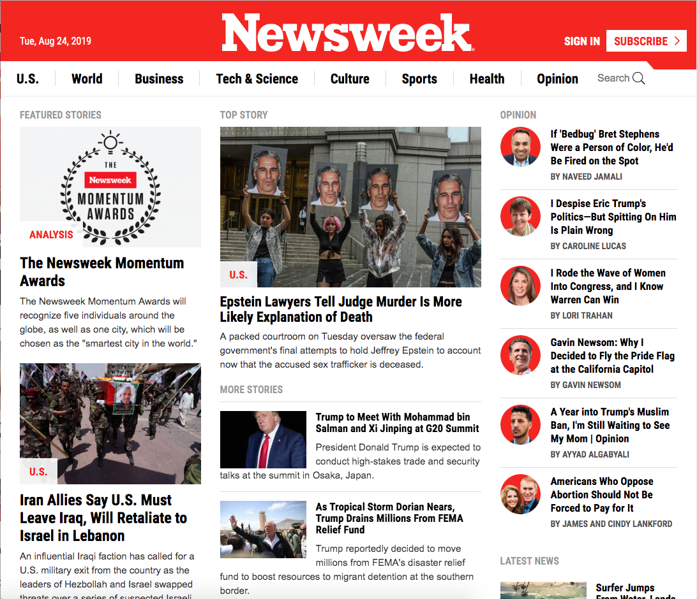

Microverse curiculum 2nd solo project

# Using Bootstrap

## Responsive-Design

For this project, I built a responsive website using Bootstrap. I made a clone of the https://newsweek.com/ , the news site that actually uses bootstrap.

Used:

- HTML5
- CSS FlexBox
- Bootstrap 4

## Author

- Nick Haralampopoulos https://github.com/macnick

## Screenshot

## The Website

Follow the link to acess to the Website: https://macnick.github.io/Using-Bootstrap/

## License

The contents of this repository are covered under the [MIT License](LICENSE).
